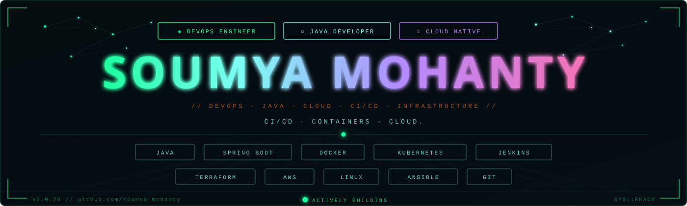

  

  <h1>👋 Hello, I’m Soumya Mohanty</h1>
  
Software Engineer | Java · Spring Boot · Microservices · AWS

  <!-- Make sure you upload a banner image named banner.png in the root of your GitHub profile repo -->
  

## 🚀 About Me
Results-driven DevOps/Java Developer with 3+ years experience in building scalable Java/Spring Boot microservices, automating infrastructure, managing CI/CD pipelines, ensuring secure and scalable environments.  
🔭 Working on AI-powered backend services · 🌱 Learning DevSecOps & MLOps· 📫 swagjaggy@gmail.com

## 🛠️ Tech Stack
<!-- Programming Languages -->

<!-- Frameworks & Libraries -->

<!-- Tools & Technologies -->

<!-- Version Control -->

<!-- Monitoring -->

<!-- Cloud & DevOps -->

<!-- Other Skills -->

## 📊 GitHub Stats

  
  
  

## 🏆 Featured Projects

### 🛍️ E-Wallet Backend Application  

An E-Wallet App based on Spring Boot including Micro-services Architecture. In order to use this application you may require few things like MySQL, Postman(to hit the end-points) in order to check the REST-API of my application.  
[Source Code](https://github.com/mohantyjagan357/E-Wallet) 

### ✉️ Group-Chatting-Application

This a "Group Chatting Application". In order to use this you might require few things that are you mst have installed JDK in your system, you shold have good IDE like IntelliJ & a DB I'LL prefer MySQL. First you need to run the server Then the clients. 
[Source Code](https://github.com/mohantyjagan357/Group-Chatting-Application)  

## 📝 Certifications

- 

## 📈 Contribution Graph

  

## 🎯 Current Goals
- 🔥 Contribute to 5 major open source projects this year  
- 📚 Complete AWS Solutions Architect certification  
- 🛠️ Build and deploy a production-ready microservices platform  
- ✍️ Publish 10 technical blog posts on backend best practices  

## 🐍 Watch a snake eating my github contributions...

<!--

  <picture>
    <source media="(prefers-color-scheme: dark)" srcset="https://raw.githubusercontent.com/mohantyjagan357/mohantyjagan357/output/github-contribution-grid-snake-dark.svg" />
    <source media="(prefers-color-scheme: light)" srcset="https://raw.githubusercontent.com/mohantyjagan357/mohantyjagan357/output/github-contribution-grid-snake.svg" />
    
  </picture>

 -->

## 🌐 Connect with Me

  
    
    

> **Thanks for visiting!** 😊
